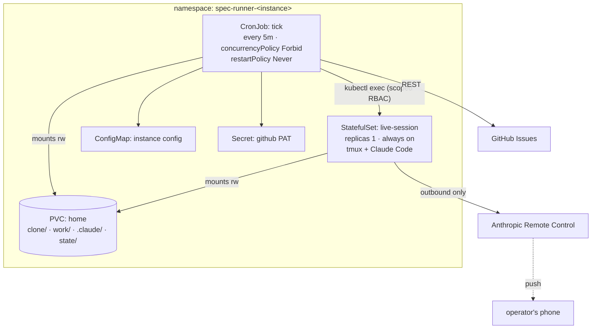

# Design: hosting the runner on Kubernetes

**Status**: proposal — not ratified, not built. Written 2026-07-26.
**Decision owner**: the operator. Turning this into work means filing it as an issue
(`kind/feature`) against this repo, which the runner can then implement through its own pipeline.

---

## Summary

Moving the tick off a laptop and into Kubernetes is a **good structural fit** and mostly
mechanical. The tick already acquires a lock, does one unit of work, and exits — which is exactly
the shape of a `CronJob`. The domain layer, GitHub adapter, stage machinery, and every test move
unchanged.

Three things need real design, and one of them would silently break the pipeline if it were
missed:

| Concern | Severity | Resolution |
|---|---|---|
| Intermediate stage artifacts are **uncommitted** in the worktree | **breaking** | worktree must live on a PVC, never an ephemeral checkout |
| Claude credential refresh is written to disk | **unknown risk** | probe first; PVC sidesteps it |
| Live sessions outlive any tick pod | **architectural** | separate long-lived session pod (chosen) |

The genuine win is availability: the queue drains 24/7 instead of whenever the laptop is awake
and unslept.

---

## Motivation

Today launchd fires `docker run` every 5 minutes against a local Docker daemon. That means:

- **No ticks while the laptop sleeps** — which is precisely the window the system exists to use.
- The laptop is a single point of failure and a deployment target.
- Multiple instances all contend for one machine's CPU and one Docker daemon.

Kubernetes fixes availability and gives per-instance resource isolation. It does not change what
the runner *does*.

---

## What does not change

This is the payoff of the ports-and-adapters structure the constitution mandates (§5):

- **The entire `Domain/` layer** — stage derivation, intake, work selection, readiness,
  recurrence, audit selection, credential parsing. Pure, untouched.
- **`Adapters/GitHub`** — the queue is GitHub either way.
- **`Ticking/`** orchestration — lock, operator resolution, selection, dispatch.
- **All 139 tests**, which never touch a real cluster or a real Docker daemon.

The changes are confined to *how a tick is scheduled*, *where its filesystem lives*, and *where a
live session is hosted*.

---

## Architecture



### Component mapping

| Today | Kubernetes | Notes |
|---|---|---|
| launchd `StartInterval 300` | `CronJob` `schedule: "*/5 * * * *"` | 1-minute granularity is ample |
| file lock in the volume | `concurrencyPolicy: Forbid` | controller-level; keep the file lock too, it's free and covers manual runs |
| `docker run --rm` | `restartPolicy: Never`, `backoffLimit: 0` | **do not retry a failed tick** — the next tick converges (crash-convergence property) |
| named volume `sr-<x>-home` | `PersistentVolumeClaim` | same layout, same reasons |
| `~/.config/spec-runner/*.toml` | `ConfigMap` | mounted at `/etc/spec-runner/config.toml` |
| `~/.config/spec-runner/github.pat` | `Secret` | mounted at `/run/secrets/github_pat`, mode 0400 |
| local tmux in the tick container | `kubectl exec` into the session pod | see below |

---

## Constraint 1 — the worktree must be persistent (breaking if missed)

**The trap in "git checkouts in pods."** The runner commits *only* at the implement stage
(`Tick.cs`, `RunImplementAsync`). The `specify`, `plan`, `tasks`, and `analyze` stages write
`spec.md` / `plan.md` / `tasks.md` into the worktree and never commit them. Stage derivation then
reads those files back off disk to decide what runs next (`SnapshotFrom`).

With a fresh clone per pod, a feature item loops forever:

```
tick 1 → no spec.md → run specify → writes spec.md → pod exits → file gone
tick 2 → no spec.md → run specify → …
```

It never advances, and it burns Claude credits every cycle. Chores would appear to work (one
implement stage, commits immediately), which makes this a nasty partial failure — the kind that
looks fine in a smoke test and fails on the first real feature.

**Resolution:** one PVC per instance mounted at `/home/runner`, carrying `clone/`, `work/`,
`.claude/`, and `state/`. This is the current volume layout lifted verbatim, and it satisfies
FR-014 (a worktree persists for the item's entire life) and SC-003 (an open live session's files
stay byte-for-byte unchanged while other items run).

**Alternative considered and rejected:** committing intermediate artifacts to the branch after
every stage would make the worktree disposable. It also puts churn like half-written specs into
git history and changes what a PR diff means. If ephemeral pods ever become a hard requirement,
revisit — but it is a real behavioural change, not a deployment detail.

---

## Constraint 2 — the Claude credential refresh (probe before building)

Measured 2026-07-26: Claude Code's access token lives ~12 hours, and Claude Code **refreshes it
and writes the new token back to `~/.claude/.credentials.json`**. That persisted today only
because the volume is durable.

If `~/.claude` came from a `Secret` onto an ephemeral filesystem, each pod would start from the
same stored credential and refresh independently. Whether that works depends on a fact not yet
established:

> **Open question:** is the claude.ai refresh token reusable, or single-use/rotating?

- **Reusable** → each pod refreshes from the Secret independently; ephemeral is survivable
  (though wasteful).
- **Rotating** → the first pod's refresh invalidates the stored token, and **every subsequent tick
  fails to authenticate**, silently, until someone re-logs in.

Putting `.claude` on the PVC sidesteps the question entirely and matches today's proven behaviour.
That is the recommendation. The probe is still worth running, because the answer also determines
whether a *disaster-recovery* restore from Secret is viable.

**Bootstrap remains interactive.** `/login` needs a browser. On Kubernetes that means running one
throwaway interactive pod attached to the PVC (`kubectl run -it --rm` with the PVC mounted), doing
the login once, and letting the credential live on the volume thereafter. Same one-time cost as
today, one extra command.

---

## Constraint 3 — live sessions (the chosen design)

A live session is an interactive Claude Code process, parked in the blocked item's worktree,
reachable from the operator's phone, with **no timeout** (FR-023), resumable by conversation id
(FR-047), and at most one per instance (FR-025). A CronJob pod that exits in seconds cannot host
that.

**Chosen: a long-lived session pod.** A `StatefulSet` (replicas: 1) that stays up, mounts the same
PVC, and hosts tmux. `StatefulSet` over `Deployment` for stable identity and predictable
one-at-a-time rollout — which matches FR-025's "at most one live session per instance" rather than
fighting it.

### How the tick drives a session in another pod

Today `TmuxSessions` shells out to `tmux` locally through `IProcessRunner`. In-cluster, the tick
must reach tmux **inside a different pod**. Options:

| Approach | Assessment |
|---|---|
| **`kubectl exec` from the tick pod** | Recommended. Smallest change: the existing `TmuxSessions` adapter keeps its logic, and the `IProcessRunner` it is handed prefixes `kubectl exec -n <ns> <pod> --`. The ports design absorbs this cleanly. Cost: a ServiceAccount with `pods/exec` on **one named pod**, which is a real privilege and must be scoped that tightly. |
| **Session pod polls GitHub itself** | No RBAC needed, but duplicates selection/allowlist logic into a second binary and creates two writers to the same issue — more moving parts, more ways to disagree. |
| **Filesystem signalling over the PVC** | Tick drops a request file, session pod acts on it. No RBAC, but invents a bespoke IPC protocol and needs its own liveness/ack semantics. |

`kubectl exec` wins because it preserves a single decision-maker (the tick) and a single
implementation of the queue rules.

### Remote Control needs no ingress

Remote Control is **outbound-initiated** — the Claude Code client registers with Anthropic's
service and the phone reaches the session through that service. Verified in the 2026-07-25 probe,
where a container behind NAT with no inbound ports was reachable from the phone. So:

- **No** LoadBalancer, Ingress, or public endpoint.
- Egress to Anthropic must be allowed if NetworkPolicy is restrictive.

This is a meaningful simplification and worth stating plainly, because "make an interactive
session reachable from a phone" usually implies inbound networking, and here it does not.

### The volume access-mode problem

Both the tick pod and the session pod need read-write access to the same PVC. This is the sharpest
infrastructure constraint in the design:

- `ReadWriteOnce` = one **node** may mount it read-write. Two pods can share it **only if they are
  scheduled on the same node**. Workable via `nodeAffinity` / `podAffinity` pinning both workloads
  together — at the cost of losing free rescheduling.
- `ReadWriteOncePod` = strictly one pod. **Incompatible** with this design.
- `ReadWriteMany` = the clean answer, but requires a backing store that supports it (NFS, CephFS,
  EFS, Azure Files). Not available on default block storage in most managed clusters.

**Recommendation:** RWX if the cluster has it; otherwise RWO with both workloads pinned to one
node. Pinning is acceptable here — the system is explicitly single-instance-per-repo and does not
need HA. Do not silently assume RWO "just works" with two pods; it fails at schedule time on
different nodes, which looks like a mysterious pending pod.

---

## Code changes required

Modest, and mostly at the edges:

1. **Multi-arch image.** `Dockerfile` hardcodes `-r linux-arm64` (lines 11, 14). Cloud nodes are
   usually amd64. Parameterise the RID and build with `buildx --platform linux/amd64,linux/arm64`.
2. **A live-session host seam.** Introduce `ILiveSessionHost` (or inject a process runner that
   prefixes `kubectl exec`). Two implementations: local tmux (today, laptop) and in-cluster exec.
   The existing `TmuxSessions` logic and `LiveSession` domain helpers are reused as-is.
3. **Config additions** for cluster mode: namespace, session pod name/selector. Optional — could
   be environment variables so the config schema stays deployment-agnostic.
4. **Manifests** — CronJob, StatefulSet, PVC, ConfigMap, Secret, ServiceAccount + Role +
   RoleBinding scoped to `pods/exec` on the one session pod.
5. **`doctor` extension** — a cluster-mode check that the session pod is reachable and the PVC is
   writable, so misconfiguration surfaces before a tick needs it.

Nothing in `Domain/` changes. That is the point.

---

## Security posture

Kubernetes **improves** most of it and adds one new privilege to watch:

| Property | Change |
|---|---|
| Blast radius | Improved — namespace isolation, resource limits, pod security standards, NetworkPolicy egress control |
| Secret handling | Improved — Secret with 0400 mount beats a host file, and can integrate with a real secret manager |
| Credential exposure | Unchanged — PAT permission ceiling (issues/contents/PRs) is what bounds damage (constitution §6, v4.0.0) |
| **`pods/exec` privilege** | **New risk.** The tick's ServiceAccount can exec into the session pod. Scope with `resourceNames` to that single pod, never a wildcard — exec across a namespace is close to node-level access |
| Prompt-injection surface | Unchanged — same allowlist, same marker discipline |

The container-is-the-boundary invariant (constitution §2) holds; the boundary is now a pod.

---

## Cost

The honest trade: today's cost is zero marginal (a laptop you already own). Kubernetes means a
node running 24/7 plus a persistent volume per instance, and the **session StatefulSet is always
on even when no session is live** — that is the price of keeping the phone-escalation path.

If cost matters more than instant availability of the live channel, the session pod could scale to
zero and be scaled up by the tick when a block occurs, at the cost of ~pod-start latency before the
push arrives. Worth considering; not recommended for a first cut, since it adds a failure mode to
the path that is already the most delicate.

---

## Migration path

Phased, each step independently verifiable:

1. **Multi-arch image** — build and confirm the existing laptop deployment still works on it.
2. **Tick-only on cluster, live channel disabled.** CronJob + PVC + ConfigMap + Secret. Run one
   instance against a low-stakes repo. Verify a *feature* item (not just a chore) advances across
   several stages — that is what proves the PVC decision.
3. **Add the session StatefulSet** and the exec seam. Verify spawn, phone attach, resume-by-id,
   and reap. This step needs manual verification; it cannot be covered by the offline suite.
4. **Cut the laptop instance over**, or keep it for repos where a live session is wanted locally.

Steps 1–2 are low-risk and independently useful. Step 3 is where the real work is.

---

## Open questions to resolve before building

1. **Is the claude.ai refresh token reusable or rotating?** Determines whether `.claude` on a PVC
   is a convenience or a hard requirement (see Constraint 2).
2. **Does the target cluster offer RWX storage?** If not, both workloads pin to one node.
3. **Which cluster?** Managed (EKS/GKE/AKS), or a homelab cluster? Affects arch, storage classes,
   and cost.
4. **Does `kubectl exec` deliver tmux keystrokes reliably enough for the kickoff?** FR-021a already
   requires poll-then-send rather than blind send because the local path was unreliable one time in
   two; an exec hop adds latency and a new failure mode. Probe before trusting it.
5. **Does the operator want per-repo namespaces or one namespace with per-repo resources?**
   Namespaces give cleaner RBAC and quota boundaries.

---

## Explicitly out of scope

- **Multi-instance coordination.** Instances still never coordinate (constitution §3). Kubernetes
  does not change that and must not be used to sneak it in.
- **Horizontal scaling of ticks.** One unit of work per tick per instance is a design invariant
  (FR-009), not a performance limitation to be optimised away.
- **Running more than one live session per instance.** FR-025 stands; `replicas: 1` encodes it.
